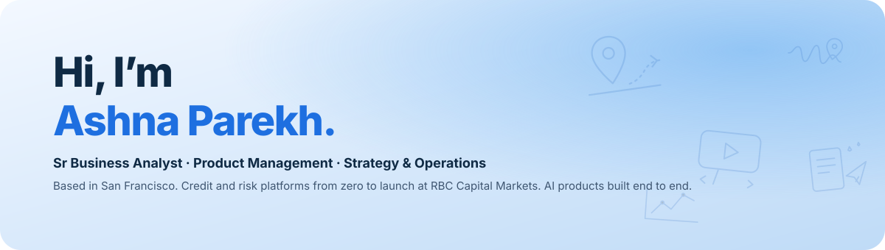

    

 

| Project | In two lines | |
|:--|:--|:--|
| **Gordón for DoorDash** ★ 1st place | Merchant inventory that promotes dishes before ingredients expire and switches items off before they stock out. Nexla · Zero.xyz · Pomerium · OpenAI |     |
| **YouTube Learning Sandbox** | Pause a coding tutorial and practice the code right there, with hints generated from the video. Monaco · Piston · YouTube IFrame API · OpenAI |     |
| **DropPoint for Spotify** | Pin a moment in a song, tag the feeling, get playlists built from that feeling. RocketRide · XTrace · Butterbase · Last.fm |      |
| **Live Coach for Strava** | A real-time voice coach that talks to you mid-run instead of after it. Vapi · Redis · Senso |    |
| **Google Maps Event Discovery** | Enter a destination and how long you'll be there; Maps surfaces what's happening nearby. |    |
| **Managed-Match for Airbnb** | Airbnb pairs hosts with a local co-host whose strengths cover their weak sub-scores. Built from SF listing data. |   |
| **Reddit Intelligence Reports** | Weekly reports that turn subreddit activity into a product roadmap for enterprise PMs. |   |
| **AR Pickup for Uber** | Open the camera when your driver arrives, get pointed to the car, verify the plate. 30.8% of cancellations happen at that moment. |   |

 

| Project | In two lines | |
|:--|:--|:--|
| **Handoff** ★ 1st place · 3 awards | Offboarding agent. Maps a leaving engineer's work, interviews them, and runs the handover in Jira and Slack. FalkorDB · LaserData · RocketRide · Guild.ai |    |
| **Argus** ★ 1st place | QA agent. Give it a URL, it tests the product from its docs, clips the exact failure on video, files the ticket. Senso · Replay · Guild · Jira · Playwright |    |
| **The Org** ★ 1st place | Builds AI personas from real customer data to A/B test a support agent before rollout. |  |
| **Propel AI** ★ Top 5 · YC Next Unicorn | Reads a 200-page RFP and drafts a complete proposal in under 60 seconds. RunPod · TokenRouter · Claude |    |
| **EvalForge** ★ 2nd place | Red-teams LLMs with 25 adversarial tests and ranks them on policy adherence against cost. |  |
| **Suits** ★ Best Use of InsForge | A sandbox where lawyers test AI legal workflows before using them on real matters. InsForge · Daytona |  |
| **Credit Risk Analyzer** | Upload a 10-K, get 12 credit ratios, covenant flags and a decision, with a confidence score per field. FastAPI · pdfplumber · PostgreSQL · Streamlit |    |
| **BA / QA Assistant** | Watches a live meeting transcript, extracts the bugs, files the Jira ticket and QA doc before the meeting ends. Node.js · Contextual AI · Redis · Jira |   |
| **Agent Passport** | Identity-aware spend governance for an agent stack. Headcount changes, every provisioned service rebalances. Stripe · WorkOS · Auth0 · Vercel |  |
| **CortexLens** | Chaos engineering for AI agents. Finds the token load where an agent fails, and which module fails first. Claude API · Composio |  |
| **Margaret** | AI memory companion for a person living with dementia, with a caregiver dashboard. MongoDB Atlas · LangChain · Voyage |  |
| **The Storefront** | One sentence becomes a live business: four strategies, market-tested, one goes live and takes real orders. Whop |  |

 

SQL · Tableau · Python / Pandas · A/B testing · JIRA · Claude Code · Cursor · MCP &nbsp;·&nbsp; <a href="https://ashna16.github.io/">ashna16.github.io</a>

