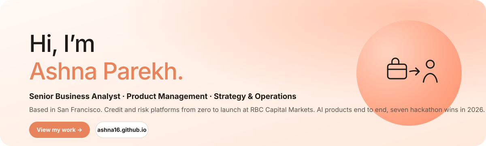

  <a href="https://ashna16.github.io/"><b>Portfolio</b></a> &nbsp;·&nbsp;
  <a href="https://www.linkedin.com/in/ashna-parekh-50b025110/"><b>LinkedIn</b></a> &nbsp;·&nbsp;
  <a href="https://www.youtube.com/@BuildWithAshna"><b>YouTube</b></a> &nbsp;·&nbsp;
  <a href="https://ashna16.github.io/assets/Ashna_Parekh_Resume.pdf"><b>Resume</b></a> &nbsp;·&nbsp;
  <a href="mailto:ashna.parekh1998@gmail.com"><b>Email</b></a>

 

  

 

### Automated workflows and AI agents

| | Project | In two lines | Links |
|:--|:--|:--|:--|
| ★ | **Handoff** | Offboarding agent. Maps a leaving engineer's work, interviews them, and runs the handover in Jira and Slack. 1st place, 3 awards · FalkorDB · LaserData · RocketRide · Guild.ai | [Code](https://github.com/Ashna16/HandOff_Memory-Layer-for-when-your-employee-quits) · [Demo](https://youtu.be/gyzEk3VCKyg) · [Post](https://www.linkedin.com/feed/update/urn:li:activity:7490561674958172160/) |
| ★ | **Argus** | QA agent. Give it a URL, it tests the product from its docs, clips the exact failure on video, files the ticket. 1st place · Senso · Replay · Guild · Jira · Playwright | [Code](https://github.com/Ashna16/Argus) · [Demo](https://www.youtube.com/watch?v=ybS23YwBhHQ) · [Post](https://www.linkedin.com/feed/update/urn:li:activity:7486852658482511872/) |
| ★ | **The Org** | Builds AI personas from real customer data to A/B test a support agent before rollout. 1st place | [Post](https://www.linkedin.com/in/ashna-parekh-50b025110/recent-activity/all/) |
| ★ | **Propel AI** | Reads a 200-page RFP and drafts a complete proposal in under 60 seconds. Top 5, YC Next Unicorn · RunPod · TokenRouter · Claude | [Code](https://github.com/Ashna16/PropelAI_Sell-to-Companies) · [Demo](https://www.youtube.com/watch?v=t4C707iN900) · [Post](https://www.linkedin.com/feed/update/urn:li:activity:7456426440478343168/) |
| ★ | **EvalForge** | Red-teams LLMs with 25 adversarial tests and ranks them on policy adherence against cost. 2nd place | [Post](https://www.linkedin.com/feed/update/urn:li:activity:7470936978780327938/) |
| ★ | **Suits** | A sandbox where lawyers test AI legal workflows before using them on real matters. Best Use of InsForge · Daytona | [Code](https://github.com/Ashna16/Suits_Your-Law-Assistant) |
| | **Credit Risk Analyzer** | Upload a 10-K, get 12 credit ratios, covenant flags and a decision, with a confidence score per field. FastAPI · pdfplumber · PostgreSQL · Streamlit | [Code](https://github.com/Ashna16/Credit-Risk-Analyzer) · [Demo](https://www.youtube.com/watch?v=UM_oAJzrbiI) · [Write-up](https://ashna16.github.io/blog.html) |
| | **BA / QA Assistant** | Watches a live meeting transcript, extracts the bugs, files the Jira ticket and QA doc before the meeting ends. Node.js · Contextual AI · Redis · Jira | [Code](https://github.com/Ashna16/Business-Analyst-Quality-Analyst---Assistant-) · [Demo](https://www.youtube.com/watch?v=8rLeV2J_g2E) |
| | **Agent Passport** | Identity-aware spend governance for an agent stack. Headcount changes, every provisioned service rebalances. Stripe · WorkOS · Auth0 · Vercel | [Code](https://github.com/Ashna16/agent-passport) |
| | **CortexLens** | Chaos engineering for AI agents. Finds the token load where an agent fails, and which module fails first. Claude API · Composio | [Code](https://github.com/Ashna16/CortexLens_Stress-Test-your-AI) |
| | **Margaret** | AI memory companion for a person living with dementia, with a caregiver dashboard. MongoDB Atlas · LangChain · Voyage | [Code](https://github.com/Ashna16/Margaret) |
| | **The Storefront** | One sentence becomes a live business: four strategies, market-tested, one goes live and takes real orders. Whop · autonomous agent cascade | [Code](https://github.com/Ashna16/The_storefront) |

 

### Product ideas: "If I were a PM"

A feature idea for a product I use every day, built as a prototype and explained in a short video. New one every week on [Build with Ashna](https://www.youtube.com/@BuildWithAshna).

| Product | In two lines | Links |
|:--|:--|:--|
| **Gordón for DoorDash** ★ | Merchant inventory that promotes dishes before ingredients expire and switches items off before they stock out. 1st place · Nexla · Zero.xyz · Pomerium · OpenAI | [Code](https://github.com/Ashna16/Doordash_gordan) · [Video](https://www.youtube.com/watch?v=QU3WXcDbqiU) · [Case study](https://ashna16.github.io/posts/doordash-merchant-inventory.html) |
| **YouTube Learning Sandbox** | Pause a coding tutorial and practice the code right there, with hints generated from the video. Monaco · Piston · YouTube IFrame API · OpenAI | [Code](https://github.com/Ashna16/Youtube_Learning-Sandbox) · [Video](https://www.youtube.com/watch?v=GNi1rW8z9PU) · [Case study](https://ashna16.github.io/posts/youtube-learning-sandbox.html) |
| **DropPoint for Spotify** | Pin a moment in a song, tag the feeling, get playlists built from that feeling. RocketRide · XTrace · Butterbase · Last.fm | [Code](https://github.com/Ashna16/Spotify_Pin-your-moment-) · [Video](https://www.youtube.com/watch?v=6I1595vN-EM) · [Case study](https://ashna16.github.io/posts/spotify-pin-your-moment.html) |
| **Live Coach for Strava** | A real-time voice coach that talks to you mid-run instead of after it. Vapi · Redis · Senso | [Code](https://github.com/Ashna16/Strava_AIPersonalTrainer) · [Video](https://www.youtube.com/watch?v=yhAhZaxjq-8) · [Case study](https://ashna16.github.io/posts/strava-live-coach.html) |
| **Google Maps Event Discovery** | Enter a destination and how long you'll be there; Maps surfaces what's happening nearby. | [Video](https://www.youtube.com/watch?v=L7YR9hNHRHE) · [Case study](https://ashna16.github.io/posts/google-maps-x-event-discovery.html) |
| **Managed-Match for Airbnb** | Airbnb pairs hosts with a local co-host whose strengths cover their weak sub-scores. Built from SF listing data. | [Video](https://www.youtube.com/watch?v=rO8jbKxyMKs) · [Case study](https://ashna16.github.io/posts/airbnb-cohost-matching.html) |
| **Reddit Intelligence Reports** | Weekly reports that turn subreddit activity into a product roadmap for enterprise PMs. | [Video](https://www.youtube.com/watch?v=UGvVvg5aQRk) · [Case study](https://ashna16.github.io/posts/reddit-intelligence-reports.html) |
| **AR Pickup for Uber** | Open the camera when your driver arrives, get pointed to the car, verify the plate. 30.8% of cancellations happen here. | [Video](https://www.youtube.com/watch?v=WlAEks8xrXQ) · [Case study](https://ashna16.github.io/posts/uber-ar-navigation.html) |

 

### Work at RBC Capital Markets, 2023 to 2026

Five credit and risk platforms taken from zero to launch as Business Analyst, then Senior Business Analyst / Product Lead. [Full detail on the site.](https://ashna16.github.io/work.html)

| Platform | In one line |
|:--|:--|
| **TMS** | Credit risk monitoring for 1,000 to 2,000 corporate borrowers. Review time 4 days to 1, 90%+ adoption. |
| **Credit Hub** | One portal for about 45 credit applications, prototype to launch, role-based access. |
| **Data Platform Modernization** | About 40 applications to SQL Server, sequenced by a risk model. Zero disruption, zero data loss. |
| **CCMS** | System of record for 11,000+ borrowers and a US$200B portfolio, feeding 15 apps. |
| **CMAP** | Financial analysis inside the credit review. Weeks to days, errors down 85%. |

 

SQL · Tableau · Python / Pandas · A/B testing · JIRA · Claude Code · Cursor · MCP &nbsp;·&nbsp; <a href="https://ashna16.github.io/">ashna16.github.io</a>

